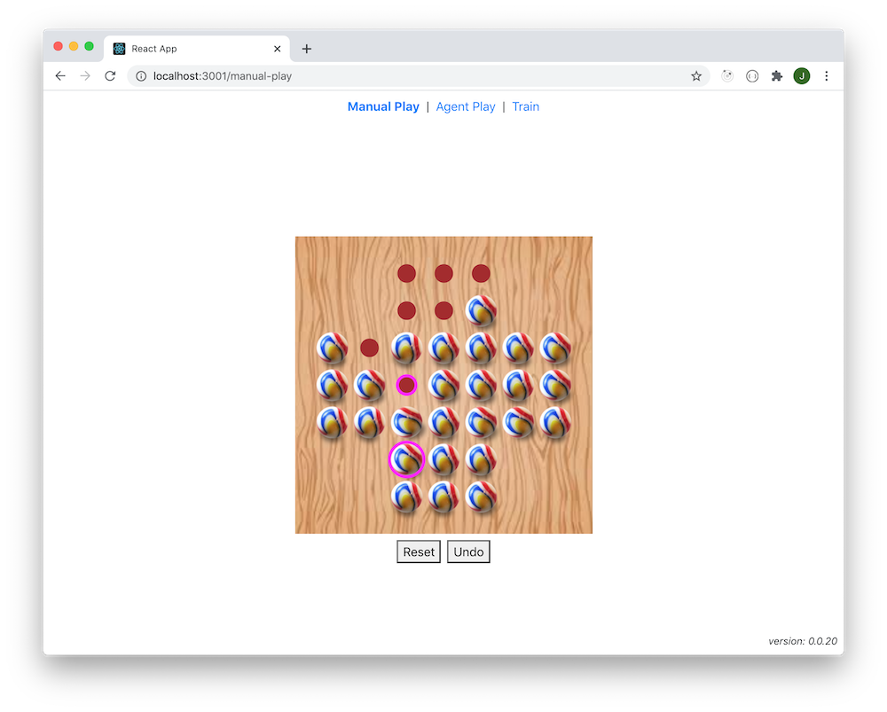
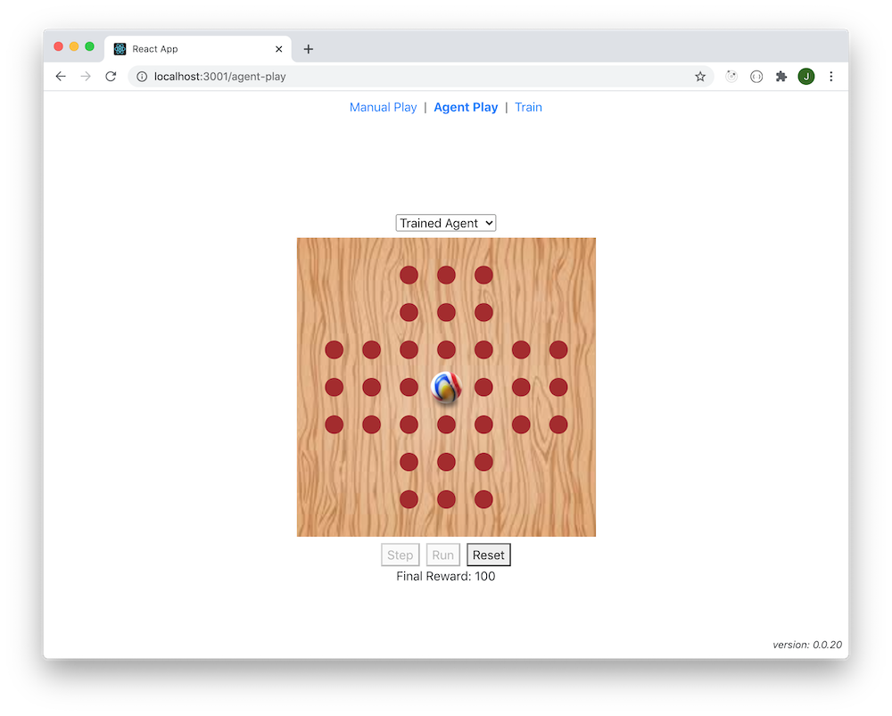

# Description

_TODO_

# Screenshots

## Manual Play



## Agent Play



## Successful Training Run

```
const LR = 0.0015
const EPSILON_START = 1
const EPSILON_END = 0.01
const EPSILON_DECAY_PC = 80
const GAMMA = 1
const MAX_EPISODES = 25000
```

```
_________________________________________________________________
Layer (type)                 Output shape              Param #
=================================================================
input-layer (Dense)          [null,33]                 1122
_________________________________________________________________
output-layer (Dense)         [null,1]                  34
=================================================================
Total params: 1156
Trainable params: 1156
Non-trainable params: 0
_________________________________________________________________
```


# TODO

* Redraw board on window size change
* Redraw board on window orientation change
* Training view functionality:
  * Add UI to allow configuration of hyperparameters
  * Allow trained models to be saved (uploaded to server)
    * Allow trained models to be given a name
    * Store date/time too
    * Store hyperparameters too
    * Store training statistics too
* Agent Play view:
  * Allow a named trained model to be chosen (once we have implemented saving of named trained models)
* Training algorithm improvements:
  * Try improve the speed of training
  * Try to improve the robustness of training
  * Can we exploit the symmetry of the game ?
    * Would be nice to produce a trained model that can handle a randomly chosen first move (not the case currently)
* Consider adding support for other [board variants](https://en.wikipedia.org/wiki/Peg_solitaire#Board_variants)
* Would it be possible to train a single model that can handle different board variants ?
  * At the very least, we would probably need to use a CNN to handle the different inputs

# Links

* [Peg solitaire](https://en.wikipedia.org/wiki/Peg_solitaire)
