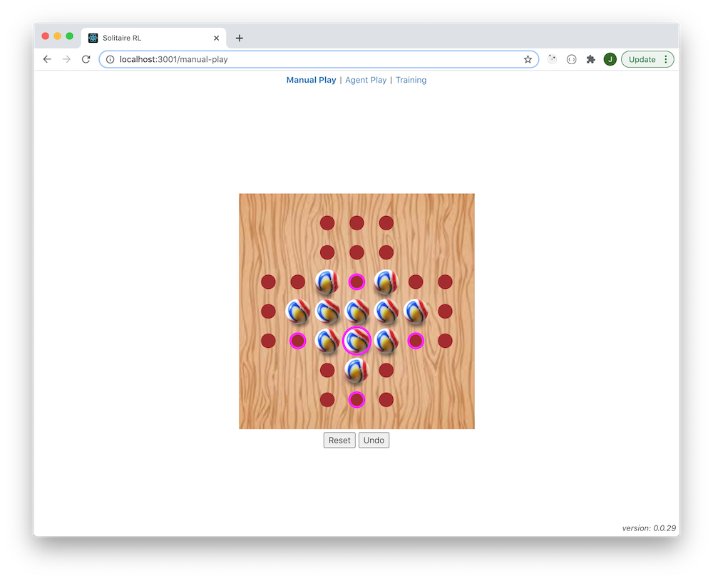
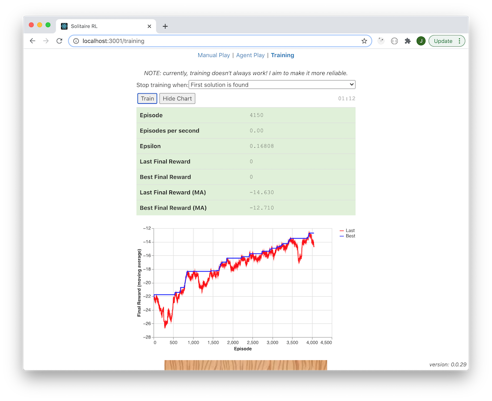

# Description

For my first foray into reinforcement learning, I decided to try to solve the
[Peg solitaire](https://en.wikipedia.org/wiki/Peg_solitaire) puzzle.
I have to admit that this has been a struggle, but in the end, I have come up with something that:

* works most of the time
  * _it doesn't always converge to a successful result_
* is pretty simple
  * _I use a one-step temporal difference (TD) approach with a small neural network_

However, I am still in the early stages of studying reinforcement learning so I shall
continue to try to discover better ways to apply reinforcement learning to this problem.

# Brute Force Approach

As a baseline, I wrote a naive bit of code to find a solution by brute force using
a depth-first search - see [bruteForce.mjs](console/bruteForce.mjs).
This code is entirely deterministic. It finds the first solution after 3,730,510 episodes.
On my MacBook Pro (Mid 2014), this takes about 5 minutes:

```
$ node console/bruteForce.mjs
...
solution: [7,13,0,4,20,11,22,29,32,0,30,32,40,3,45,40,66,47,50,5,35,58,8,65,57,74,41,72,74,63,68]
episodes: 3730510
elapsed time: 04:59
```

# Reinforcement Learning Approach

## Environment

I have implemented a `SolitaireEnv` class with the following methods/getters:

* reset()
  * returns: `observation`
* step(action)
  * returns: [`observation`, reward, done]
* validActions()
  * returns: array of valid actions
* done
  * returns: `true` if no further moves are possible else `false`
* solved
  * returns: `true` if the puzzle is solved else `false`

### Actions

There are a total of 76 actions but only a subset of these are valid in any given state.
For example, in the initial state, the following actions are valid:

* action 7 from 1,3 to 3,3 via 2,3
* action 31 from 3,1 to 3,3 via 3,2
* action 44 from 3,5 to 3,3 via 3,4
* action 68 from 5,3 to 3,3 via 4,3

### Observation

An `observation` is an array of 33 `0`s/`1`s - the board locations in reading order (left to right, top to bottom)
where a `0` represents an empty location and a `1` represents an occupied location.

* initial state: `[1,1,1,1,1,1,1,1,1,1,1,1,1,1,1,1,0,1,1,1,1,1,1,1,1,1,1,1,1,1,1,1,1]`
* solved state: `[0,0,0,0,0,0,0,0,0,0,0,0,0,0,0,0,1,0,0,0,0,0,0,0,0,0,0,0,0,0,0,0,0]`

### Reward

The value of the reward returned by `step` is as follows:

* when the episode is not done yet:
  * 0
* when the episode is done:
  * the negative sum of manhattan distances (from the centre of the board) of each remaining piece

Thus, the biggest total reward at the end of an episode is 0 (when the puzzle is solved).

My thinking, regarding the design of the reward signal, is that we want to encourage:

  * fewer remaining pieces
  * remaining pieces to be closer to the centre

## Neural Network

There are too many states for us to use a tabular implementation. Therefore, we will use
a neural network to approximate the state value function.

The architecture of the neural network is as follows:

```
_________________________________________________________________
Layer (type)                 Output shape              Param #
=================================================================
input-layer (Dense)          [null,10]                 340
_________________________________________________________________
output-layer (Dense)         [null,1]                  11
=================================================================
Total params: 351
Trainable params: 351
Non-trainable params: 0
_________________________________________________________________
```

There is one input value for each board location. There is a single output value which is interpreted as a state value.

## Policy

The policy function takes a state and epsilon and returns an action. It uses an epsilon-greedy algorithm:

* with `epsilon` probability, it chooses a random valid action
* with `1 - epsilon` probability, it chooses the best valid action

To choose the best valid action, it uses the neural network
to predict the value of the next state that each valid action leads to. It then chooses the action
that corresponds to the biggest next state value.

## Training Loop

* Loop for `MAX_EPISODES` after which give up
* For each episode:
  * Reset the environment
  * Keep stepping until the episode is done (no further moves are possible)
  * For each step:
    * Use the policy to choose an action
      * `epsilon` decays from `EPSILON_START` to `EPSILON_END` over `EPSILON_DECAY_EPISODES`
    * Step the environment using the chosen action returning the new state, a reward and a done flag
    * Calculate a new target value for the current state:
      * If the episode is not done, target = reward + GAMMA * value of next state
      * If the episode is done, target = reward
    * Calculate the loss = MSE of difference between current value of the current state and the new target value for the current state
    * Use the optimizer to back propagate the loss
  * Check whether to stop training (see next section)

## Deciding when to stop training

I guess it depends on what we are trying to achieve.

If we just want to find a solution, then we can stop training as soon as `solved` is `true`.
If we keep track of the actions taken at each step, then will have our solution.
In this mode, training always seems to succeed. Here are some typical results:

| Elapsed | Episodes | Successful ? |
| ------- | -------- | ------------ |
| 01:27 | 5099 | Yes |
| 01:28 | 5165 | Yes |
| 01:19 | 4551 | Yes |
| 00:56 | 3310 | Yes |
| 01:11 | 4164 | Yes |

Or, we may want to end up with a trained model that we can use to solve the puzzle
when following a 100% greedy policy i.e. no random moves.
In this mode, training doesn't always succeed. Here are some typical results:

| Elapsed | Episodes | Successful ? |
| ------- | -------- | ------------ |
| 01:25 | 3730 | Yes |
| 01:01 | 2769 | Yes |
| 01:50 | 4776 | Yes |
| 02:32 | 6554 | Yes |
| 01:16 | 3374 | Yes |

# Screenshots

## Manual Play



## Agent Play


## Successful Training Run



# TODO

* Redraw board on window size change
* Redraw board on window orientation change
* Training view functionality:
  * Add UI to allow configuration of hyperparameters
  * Allow trained models to be saved (uploaded to server)
    * Allow trained models to be given a name
    * Store date/time too
    * Store hyperparameters too
    * Store training statistics too
* Agent Play view:
  * Allow a named trained model to be chosen (once we have implemented saving of named trained models)
* Training algorithm improvements:
  * Try improve the speed of training
  * Try to improve the robustness of training
  * Can we exploit the symmetry of the game ?
    * Would be nice to produce a trained model that can handle a randomly chosen first move (not the case currently)
* Consider adding support for other [board variants](https://en.wikipedia.org/wiki/Peg_solitaire#Board_variants)
* Would it be possible to train a single model that can handle different board variants ?
  * At the very least, we would probably need to use a CNN to handle the different inputs

# Links

* [Peg solitaire](https://en.wikipedia.org/wiki/Peg_solitaire)
